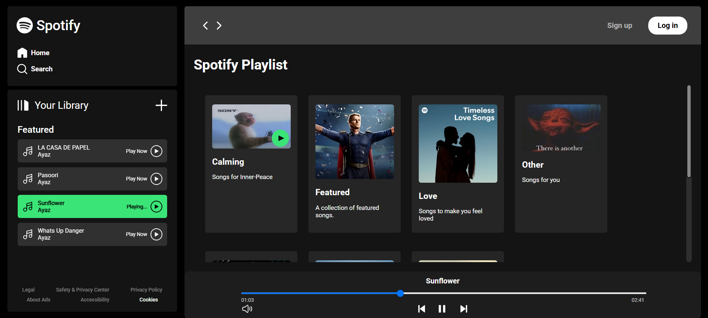
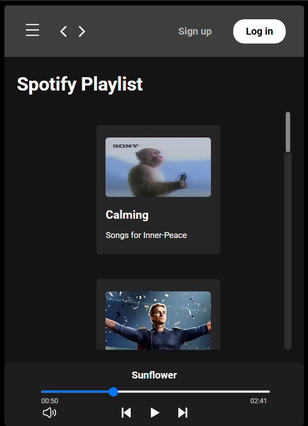
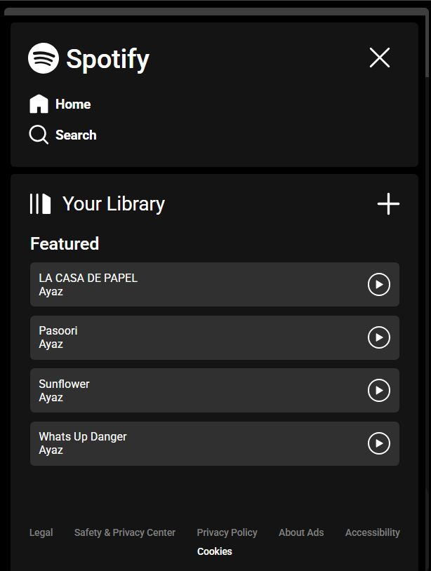

# 🎧 Spotify Clone – Web Music Player
Web-based Music Player, design inspired from Spotify

## 🚀 Features

### 📱 Responsive Design
- Optimized for various screen sizes and devices.

### 📂 Playlist & Song Management
- Automatically fetches songs from `assets/songs/` folder.
- Displays songs dynamically based on the selected playlist folder.
- Shows playlist details from `info.json` (title, description, image).

### 🎵 Playback
- Dynamic song listing per playlist.
- Highlights currently playing track.

### ▶️ Playback Controls
- Play/Pause, Next, Previous, Seekbar with draggable progress.
- Auto-pause while dragging the seekbar for precise control.

### 🔊 Volume Control
- Adjustable volume slider with dynamic Windows 11 style icon.
- Volume icon changes based on level (Low/Medium/Mute).

## 📸 Screenshots

